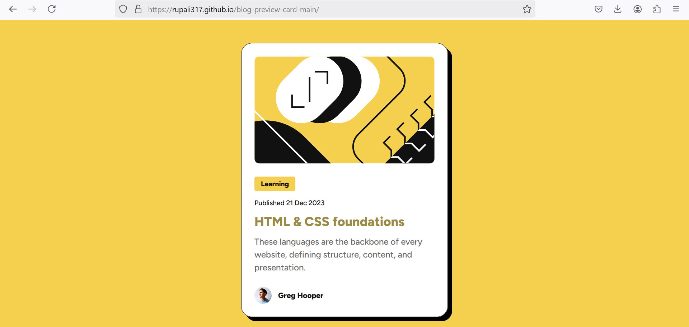

# Frontend Mentor - Blog preview card solution

This is a solution to the [Blog preview card challenge on Frontend Mentor](https://www.frontendmentor.io/challenges/blog-preview-card-ckPaj01IcS). Frontend Mentor challenges help you improve your coding skills by building realistic projects.

## Table of contents

- [The challenge](#the-challenge)
- [Screenshots](#screenshots)
  - [1. Desktop version](#1-desktop-version)
  - [2. Mobile version](#2-mobile-version)
- [PageSpeed Insights results](#pagespeed-insights-results)
- [Links](#links)
- [My process](#my-process)
  - [Built with](#built-with)
  - [Tested with](#tested-with)
  - [What I learned](#what-i-learned)
  - [Useful resources](#useful-resources)
- [Acknowledgement](#acknowledgement)
- [Author](#author)

## Overview

### The challenge

Users should be able to:

- See hover and focus states for all interactive elements on the page

### Screenshots

##### 1. Desktop version

Default state

Hover state

##### 2. Mobile version

Default state

Active state

### PageSpeed Insights results

[Mobile version](https://pagespeed.web.dev/analysis/https-rupali317-github-io-blog-preview-card-main/y6htck4h6s?form_factor=mobile)

[Desktop version](https://pagespeed.web.dev/analysis/https-rupali317-github-io-blog-preview-card-main/y6htck4h6s?form_factor=desktop)

### Links

- Solution URL: [Github solution](https://github.com/rupali317/blog-preview-card-main)
- Live Site URL: [Live URL](https://rupali317.github.io/blog-preview-card-main/)

## My process

### Built with

- Semantic HTML5 markup
- CSS custom properties
- Flexbox
- Mobile-first workflow
- [Github Pages](https://pages.github.com/) - Allows to host static websites directly from a GitHub repository.

### Tested with

- Browsers used for testing: Google Chrome, Firefox, Safari, Brave, Microsoft Edge.
- Devices:
  - (Real) MacBook Pro (15-inch), Samsung Galaxy A33 5G, Samsung Galaxy S20+, iPad Air 2, MacBook Pro (13-inch).
  - (Virtual) The mobile and tablet devices mentioned under Chrome's dev console.
- Screen reader: MacOS VoiceOver.

### What I learned

- TBD

### Useful resources

-  - This helped me ...

## Acknowledgement

- I express my gratitude towards my mentor - Deborah for the insightful code review session and for suggesting improvements.

## Author

- Website - [Rupali Roy Choudhury](https://www.linkedin.com/in/rupali-rc/)
- Frontend Mentor - [@rupali317](https://www.frontendmentor.io/profile/rupali317)
